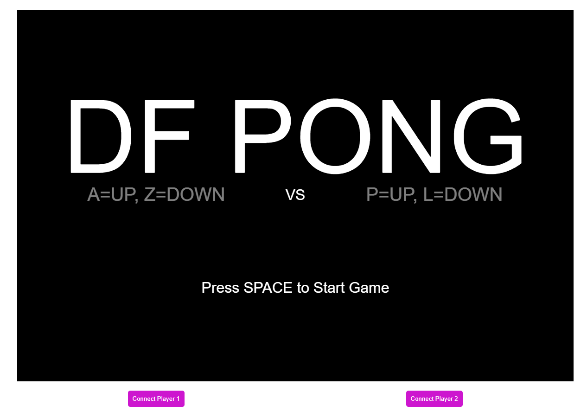

# df-pong

[Play the Game](https://digitalfuturesocadu.github.io/df-pong/)


## General Overview

df-pong provides a framework for creating unusual BLE controllers for pong.

## Controllers

This game is designed to be played with custom Bluetooth controllers. You can find the corresponding controllers and their setup instructions at the following link:
[https://github.com/DigitalFuturesOCADU/Pong-Controller](https://github.com/DigitalFuturesOCADU/Pong-Controller/game)

**Important:** When setting up controllers, make sure to:
- Name each controller with the `DFPONG-` prefix (e.g., `DFPONG-001`, `DFPONG-002`)
- Use unique numbers for each controller in a classroom setting
- This naming convention helps the game filter and find the correct devices in crowded BLE environments

## How to Play

1. **Connect Controllers**: 
   - Connect 1 or more Controllers via BLE.
   - If less than 2 Controllers are connected, the other player can use the keyboard.
   - Use the Pong Controller Framework for your Arduino Code: [Pong Controller Framework](https://github.com/DigitalFuturesOCADU/Pong-Controller)
   - Connect 1 controller at a time using the corresponding button.
   - **Note:** When reconnecting a previously paired controller, it may show as "Arduino-Paired" instead of your custom name. The game will display the real name after connection.
   - **Tip:** If you're unsure which device is yours, connect it and click the "💡 Flash" button to make your controller identify itself with LED blinks and buzzer beeps.
2. **Start Game**: Press the SPACE key to start the game.
3. **Control Paddles**: Use the controllers to move the paddles up and down.
4. **Pause/Resume Game**: Press the SPACE key to pause or resume the game.
5. **Reset Game**: Press the ENTER key to reset the game after a win or during a pause.

## Identifying Your Controller

In crowded environments with many controllers:
- The "💡 Flash" button appears when a controller is connected
- Click it to make your controller flash its LED and buzz
- This helps you physically confirm which device you're connected to
- The game remembers your device and shows the real name (e.g., "DFPONG-001") even when the browser shows "Arduino-Paired"

### Troubleshooting "Arduino-Paired" Issue

If you see multiple "Arduino-Paired" devices instead of "DFPONG-001", "DFPONG-002", etc.:

**Quick Solution - Trial and Error:**
1. Click "Connect Player 1"
2. Select any "Arduino-Paired" device
3. After connecting, check if the game shows your device name
4. Click "💡 Flash" - does your controller blink/buzz?
5. If yes, you're connected! If no, disconnect and try another

**Permanent Solution - Forget Devices:**
1. Click the "⚠️ Forget All Devices" button for instructions
2. Follow the steps to remove paired devices from your browser
3. Refresh the page
4. Devices will now show their real names ("DFPONG-001", etc.) in the picker!

## Debug Controls

There are 2 sets of debug controls for the game:

### BLE Debug
- **Toggle with 'd'**: Shows the connection status and data received in P5.

### Game Controls
- **Toggle with 'c'**: These controls set:
  - Move Speed of each player
  - Speed multiplier for the puck
  - Winning score total

## Technical Explanation

### Game Components

- **Puck**: The puck moves across the screen, bouncing off the paddles and the top and bottom edges of the screen.
- **Paddles**: Each player controls a paddle to hit the puck. The paddles can move up and down.
- **GameController**: Manages the game state, including starting, pausing, resuming, and resetting the game.
- **BLEController**: Manages the Bluetooth connections to the custom controllers.

### Connecting the Controllers

1. **Player 1**: Press the "Connect Player 1" button to initiate the connection process for the first controller.
2. **Player 2**: Press the "Connect Player 2" button to initiate the connection process for the second controller.

The game will display the connection status and handle any errors that occur during the connection process.

### Technical Details

- **Puck**: The puck's speed and direction are controlled by the `Puck` class. The speed can be adjusted using the debug GUI.
- **Paddles**: The paddles are controlled by the `Paddle` class. The movement speed can be adjusted using the debug GUI.
- **GameController**: The `GameController` class manages the game state and handles user input for starting, pausing, resuming, and resetting the game.
- **BLEController**: The `BLEController` class manages the Bluetooth connections to the custom controllers. It handles connecting, disconnecting, and receiving data from the controllers.

### Dependencies

- **p5.js**: Used for rendering the game and handling user input.
- **p5ble.js**: Used for managing Bluetooth connections.

### Installation

1. Clone the repository:
   ```bash
   git clone https://github.com/yourusername/df-pong.git
