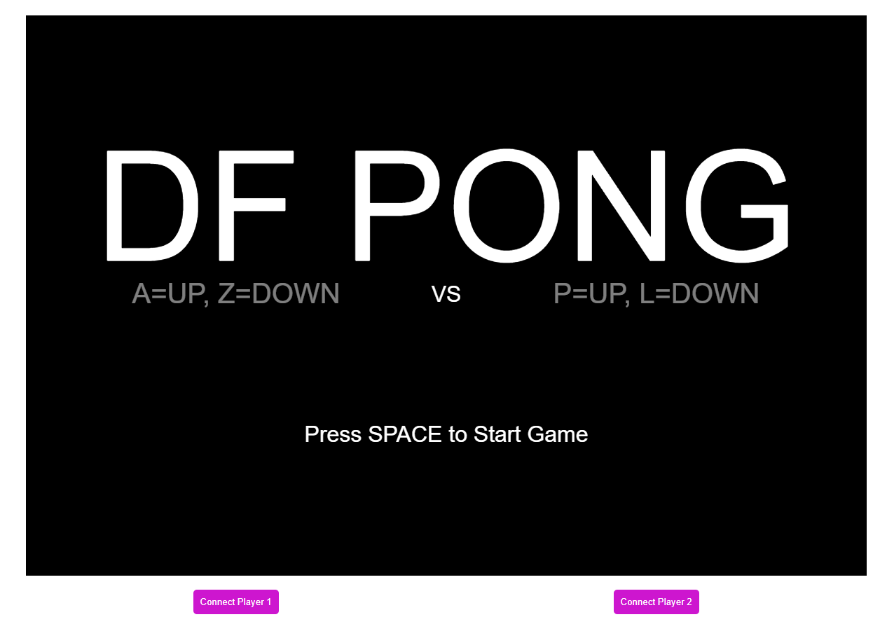

# Overview

This repository contains code for creating a wireless controller for the [DF Pong game](https://digitalfuturesocadu.github.io/df-pong/). The controller uses Bluetooth Low Energy (BLE) to send movement data to a central device and provides audio feedback through a buzzer.

## Two Button Example

The [Two Button Example](examples/BLE/DFpong_controller_2button/DFpong_controller_2button.ino) demonstrates how to create a simple wireless controller using two buttons and a piezo buzzer. This example is designed for the Nano33 IOT but can be adapted for any Arduino that supports the ArduinoBLE library.

### How it works:
- Two buttons are used to control the movement in the DF Pong game.
- A piezo buzzer provides audio feedback.
- The controller sends BLE signals to the central device to indicate button presses.

### Interaction:
- Press the left button to move up.
- Press the right button to move down.
- The buzzer will sound when a button is pressed.

## Start Template Example

The [Start Template Example](examples/BLE/DFpong_controller_startTemplate/DFpong_controller_startTemplate.ino) provides a basic template to start building your own custom controller.

### How it works:
- Basic BLE setup to connect with the DF Pong game.
- Placeholder functions for button presses and buzzer feedback.

### Interaction:
- Customize the template by adding your own buttons and buzzer logic.
- Use the provided functions to handle BLE communication and audio feedback.

## Arduino Files

- [DFpong_controller_2button.ino](examples/BLE/DFpong_controller_2button/DFpong_controller_2button.ino)
- [DFpong_controller_startTemplate.ino](examples/BLE/DFpong_controller_startTemplate/DFpong_controller_startTemplate.ino)

For more information about the DF Pong game, visit the [DF Pong GitHub repository](https://github.com/DigitalFuturesOCADU/df-pong).